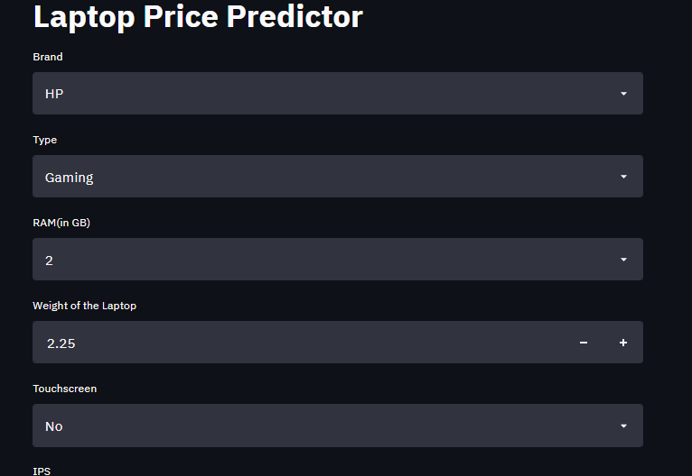

### Laptop-Price-Predictor (Demo):https://laptop-price-predictor.herokuapp.com/ 

# Laptop Price Predictor

### This Project is Called Laptop Price Predictor which build using Machine Learning. and Deployed the Machine Learning model using streamlit library in Heroku 
1. Designed a web app that predicts the price of the laptop on a given  configurations.
2.  Stages Of this Project
  (i). Data Cleaning

  (ii). EDA

  (iii). Feature Engineering

  (iv).  Modeling

  (v).  Website
  
  (vi). Deployment
## 🔗 Links
### Dataset Link:(https://www.kaggle.com/ionaskel/laptop-prices)
### Project Demo:(https://laptop-price-predictor.herokuapp.com/)

## Some of screenshot af app 
* Landing Page:
 

* Prediction Page:
(githubimage/laptop 2.PNG)

## Authors

- [@jayedo6](https://github.com/Jayed096)

